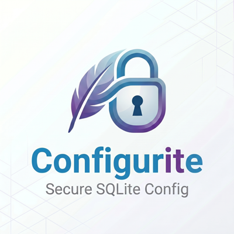

<p align="center">
  
</p>

# Configurite

> Secure, encrypted SQLite-backed configuration provider for ASP.NET Core / .NET 8+
> ASP.NET Core / .NET 8+ için güvenli, şifrelenmiş SQLite tabanlı yapılandırma sağlayıcısı

[](https://github.com/hacioguz/configurite/actions/workflows/ci.yml)
[](https://opensource.org/licenses/MIT)
[](https://dotnet.microsoft.com/)
<!--[](https://www.nuget.org/packages/Configurite/)-->
---

## 🌍 Languages / Diller

- 🇬🇧 [English Documentation](docs/en/README.md)
- 🇹🇷 [Türkçe Dokümantasyon](docs/tr/README.md)
- 📖 [Full docs site (GitHub Pages)](https://hacioguz.github.io/configurite/) — searchable, with auto-generated API reference

---

## 🚀 Quick Start / Hızlı Başlangıç

### Install / Kurulum

```bash
dotnet add package Configurite
```

### Use / Kullanım

```csharp
using Configurite;

var builder = WebApplication.CreateBuilder(args);

builder.Configuration.AddConfigurite("appsettings.db");

var app = builder.Build();
```

---

## ✨ Features / Özellikler

| Feature / Özellik | Status |
|---|:---:|
| 🔐 AES-256-GCM Encryption / Şifreleme | ✅ |
| 🔄 Hot Reload | ✅ |
| 🔑 PBKDF2 Key Derivation | ✅ |
| 📦 Zero JSON files in production / Production'da JSON yok | ✅ |
| 🔧 Standard `IConfiguration` API | ✅ |
| 🏗️ JSON → SQLite Migration Tool | ✅ |
| 🌐 Bilingual Docs (EN/TR) | ✅ |

---

## 📜 License / Lisans

MIT — see [LICENSE](LICENSE)
